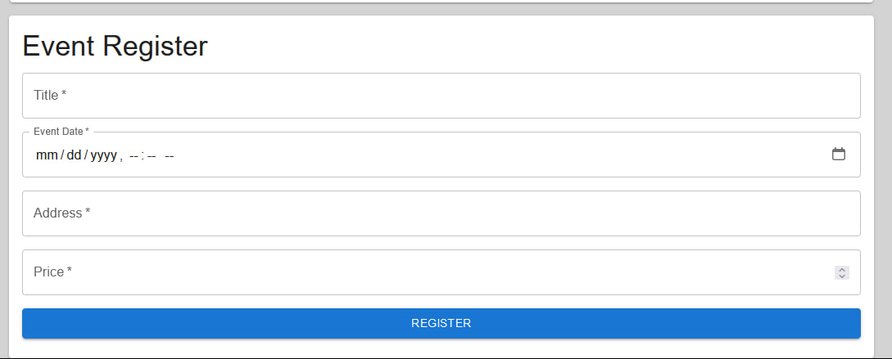

# SpeedDating

SpeedDating is a single page application that allows users to create profiles, register for events, and create events, including administrative controls for deleting and locking user accounts. 

## Features

- **User Profile Creation**: Users can sign up and create their own profiles, providing personal details and a photo.

- **Event Registration**: Users can browse available events, register to them and create new events.

- **Event Management**: Administrators can delete events.

- **Admin Panel**: Administrators have the ability to manage user accounts, with the option to delete or lock out users.

## Screenshots

Below are various screenshots demonstrating the functionality of the SpeedDating application:

### User Profiles


Users can create and edit their profiles, adding personal information and photos.

### Event Listings


All upcoming and past events are listed here. Users can see event details, including registered users and register to join.

### Admin Panel


The admin panel provides a comprehensive view of all users and their profiles, with admin actions available.

### Event Registration Form



A simple and intuitive form for users to register for new events.


## Installation

Instructions on how to set up and run the project locally.
1. Clone the repository
2. Navigate to project directory
3. Run Java and React on docker-compose
```bash
docker-compose up --build -d
```
4. Go to localhost:3000.

